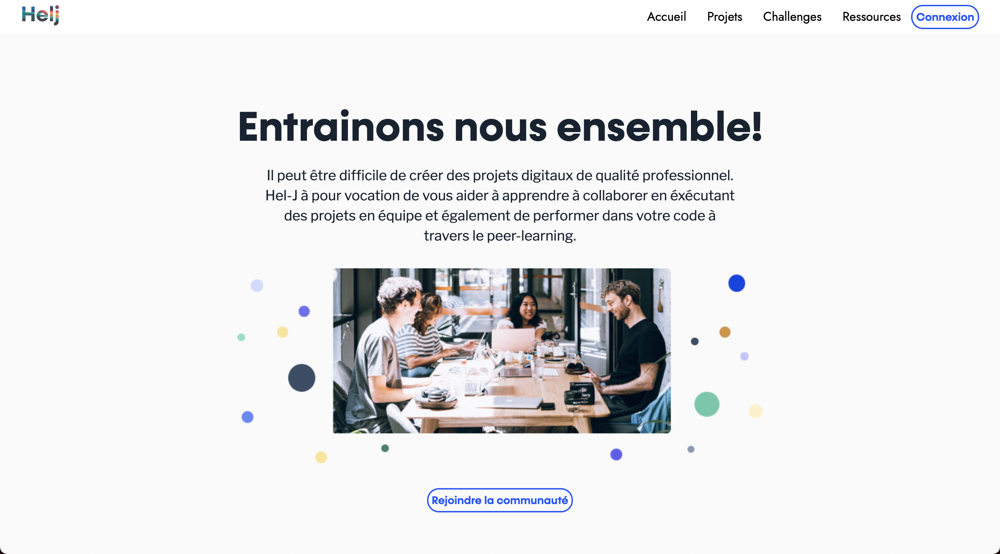

# HelJ (Version Francaise)

Cette application est un site de mise en relation de web developpeur Juniors, réalisé dans le but d'apprendre en équipe, et de mutualiser nos compétences après 3 mois de formation en développement web. Il a été réalisé en 10 jours. 
 

## ACCES:

Voici notre lien heroku pour tester le site directement :`https://hel-j.herokuapp.com/`.
Pour vous connecter, 2 choix d'offrent à vous :  

Utiliser le Admin de test:  

* Email Admin--> `foobar@gmail.com`  
* Mot de passe --> `foobar`  (mot de passe minimum 6 cararatères)

Ou passez par le processus d'inscription classique.  

## OUTILS:
 
- Ruby on Rails  
- Ruby 2.7.3  
- Rails 6.1.3.2  
- JavaScript 
- gem Devise
- gem rspec
- gem chartkick
- gem groupdate

## API:

-Github
-Google Authentificator

## Database:

-Postgresql

## FONCTIONNALITÉS:

 - Pacourir les différents challenges
 - Rejoindre et quitter un challenge  
 - Afficher les détails d'un challenge
 - Afficher les Challenges auxquels l'utilisateur a particper sur son profils
 - Afficher les challenges et leurs détails
 - Se connecter et se déconnecter  
 - Afficher les pages profils  

 - Afficher Une page administrateur / Dasboard
 - Afficher une page listing des projets
 - Afficher une page listing des challenges
 - Afficher une page listing des besoins
 - Afficher une page listing des utilisateurs
 - Afficher une page creation de besoin administrateur   
 - Afficher une page creation de projet administrateur  
 - Afficher une page creation de challenges administrateur  

## CREDIT
Merci à notre mentor Andy Hazard pour sa dispo tout au long du projet.  

## EQUIPE

- Xabi Aycaguer 
- Jocelin Queau    
- Leo Lair   
- Anthony Charron  

______________________________________________________________________________________________________________

# HelJ (English version)

This application is a website to put in contact junior web developers, created with the aim of learning as a team, and to share our skills after 3 months of training in web development. It was made in 10 days.  

## ACCESS:

Here is our heroku link to test the site directly: `https://hel-j.herokuapp.com/`.
To connect, you have 2 choices:  

Use the test Admin:  

* Email Admin--> `foobar@gmail.com`  
* Password --> `foobar` (minimum password 6 characters)

Or go through the classic registration process.  

## TOOLS:
 
- Ruby on Rails  
- Ruby 2.7.3  
- Rails 6.1.3.2  
- JavaScript 
- gem Currency
- gem rspec
- gem chartkick
- gem groupdate

## API:

-Github
-Google Authentificator

## Database:

-Postgresql

## FEATURES:

 - Browse the different challenges
 - Joining and leaving a challenge  
 - View the details of a challenge
 - View Challenges the user has participated in on their profile
 - View challenges and their details
 - Login and logout  
 - View profile pages  

 - View an admin / Dasboard page
 - View a project listing page
 - View a challenges listing page
 - View a requirements listing page
 - View a user listing page
 - View a Create Administrator Requirement page   
 - View a project creation page as an administrator  
 - View a challenge creation page as an administrator  

## CREDIT
Thanks to our mentor Andy Hazard for his availability throughout the project.  

## TEAM

- Xabi Aycaguer 
- Jocelin Queau    
- Leo Lair   
- Anthony Charron  

